# Self-Hosted n8n on AWS — Production-Style Deployment

A weekend project to stand up **n8n** (the workflow-automation platform) on AWS the way a real team would run it: hardened host, HTTPS, a managed database, **queue mode with separate workers**, automatic TLS, resilience under failure, and a clean migration from Docker Compose to **Kubernetes (k3s)** — followed by a full, cost-zero teardown.


---

## TL;DR

| | |
|---|---|
| **Cloud** | AWS `eu-central-1` (Frankfurt), EC2 `t3.medium` |
| **Orchestration** | Docker Compose → migrated to **k3s** (lightweight Kubernetes) |
| **Core services** | n8n (main + workers), PostgreSQL, Redis, Caddy |
| **Ingress / TLS** | Caddy reverse proxy, automatic HTTPS via Let's Encrypt; DuckDNS dynamic DNS |
| **Scaling model** | n8n **queue mode** — main process + Redis broker + horizontally scalable workers |
| **Resilience shown** | container failover, self-healing, rolling updates, worker scaling |
| **Cost control** | AWS Budgets `$10` alarm, a dedicated MFA-enabled IAM user, full teardown at end |
| **Secrets** | stored as n8n Header-Auth credentials, never committed to the repo |

---

## Why this project

Self-hosting n8n in production isn't "run one container." It means thinking about the database, TLS, secret management, how executions scale, what happens when a worker dies, how you ship an update without downtime, and how you keep the bill predictable. This project works through each of those decisions deliberately and documents the trade-offs.

---

## Architecture

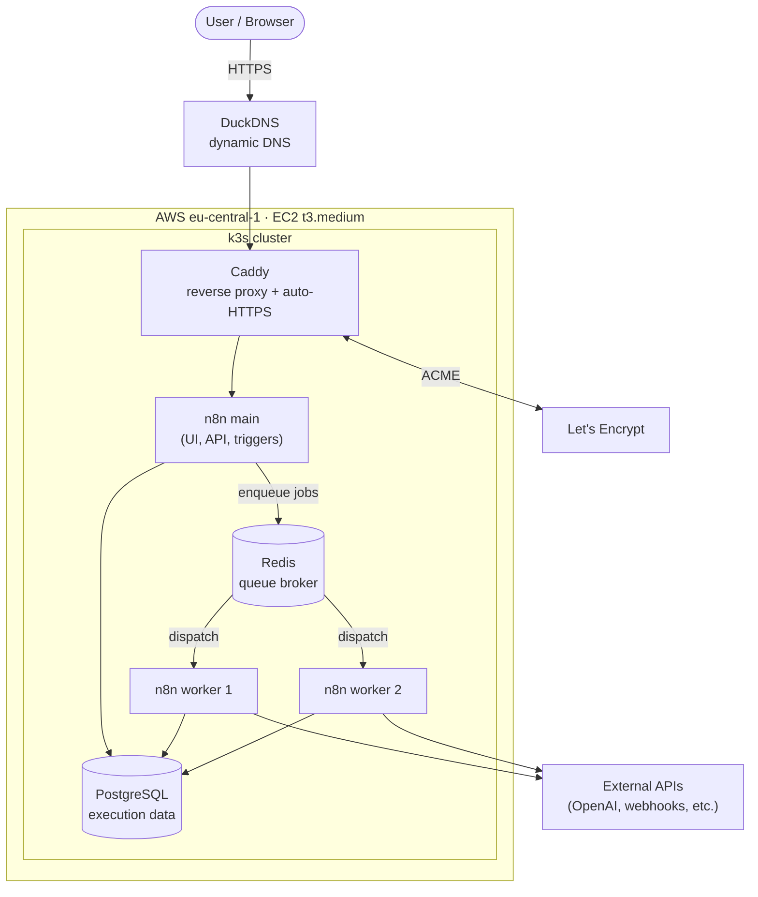

A rendered version of this diagram is in [`architecture.svg`](architecture.svg) / [`architecture.png`](architecture.png).

**How a request flows:** the browser hits the DuckDNS hostname over HTTPS → Caddy terminates TLS (certs auto-provisioned and renewed via Let's Encrypt) and proxies to the n8n **main** process. Main serves the editor/API and registers triggers, but it does **not** run workflow executions itself — it enqueues them in **Redis**. One or more **worker** processes pull jobs off the queue and execute them, writing execution state to **PostgreSQL**. This separation is what lets executions scale horizontally and keeps the UI responsive under load.

---

## Build phases

The build went in six phases, each captured with screenshots in this repo.

### Phase 0 — Account & guardrails
Created a dedicated, MFA-enabled IAM user, set an AWS Budgets **$10 billing alarm**, generated an SSH key pair, and registered a DuckDNS hostname for dynamic DNS.

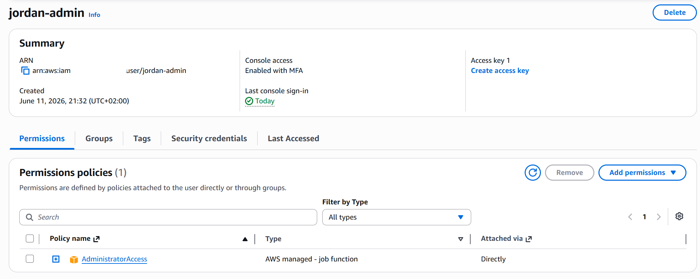
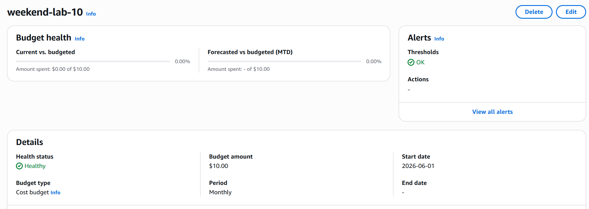

### Phase 1 — Provision & harden the host
Launched an EC2 `t3.medium` in `eu-central-1` with a tightly scoped security group (SSH from my IP, 80/443 for web).

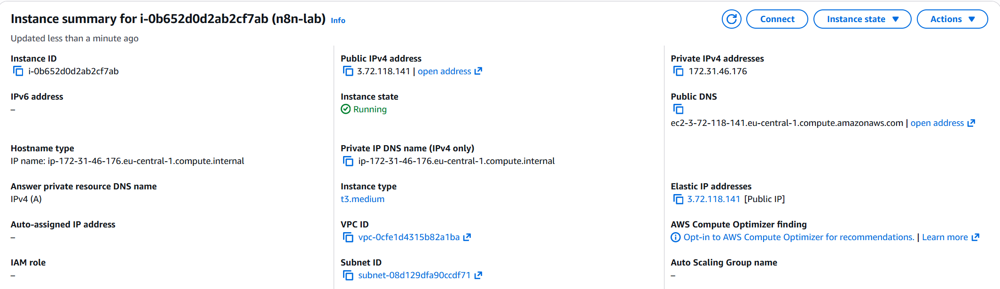
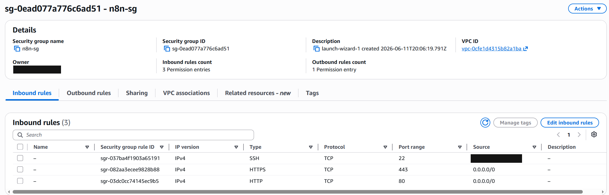

### Phase 2 — Core stack on Docker Compose
Brought up n8n + PostgreSQL + Caddy via Docker Compose, with automatic HTTPS and an error-handling workflow that posts failures to Discord.

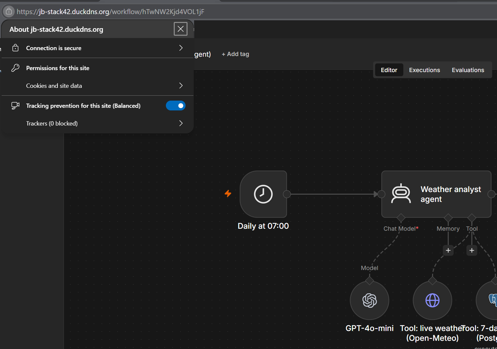
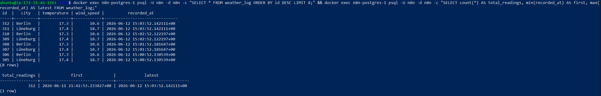
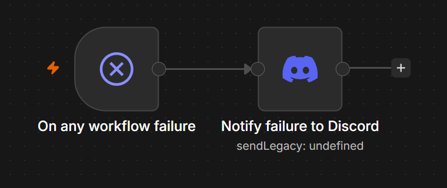
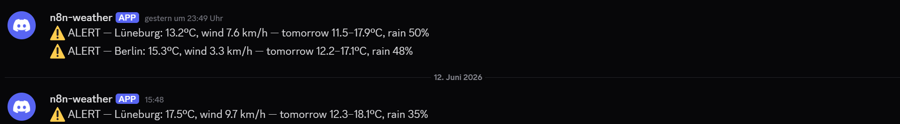
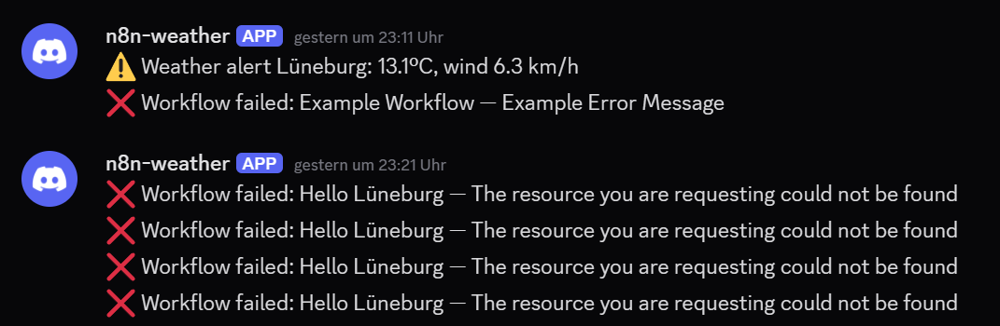
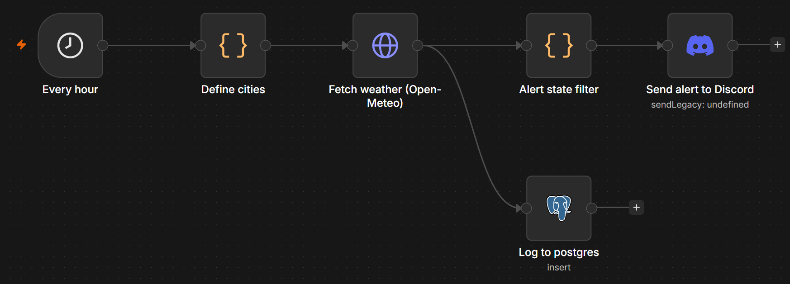

### Phase 3 — Queue mode (scale-out executions)
Reconfigured n8n into **queue mode**: a Redis broker plus dedicated worker containers. Demonstrated **failover** (kill a worker, jobs keep running) and **self-healing** (the container comes back automatically).

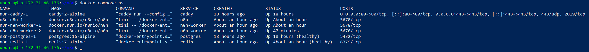
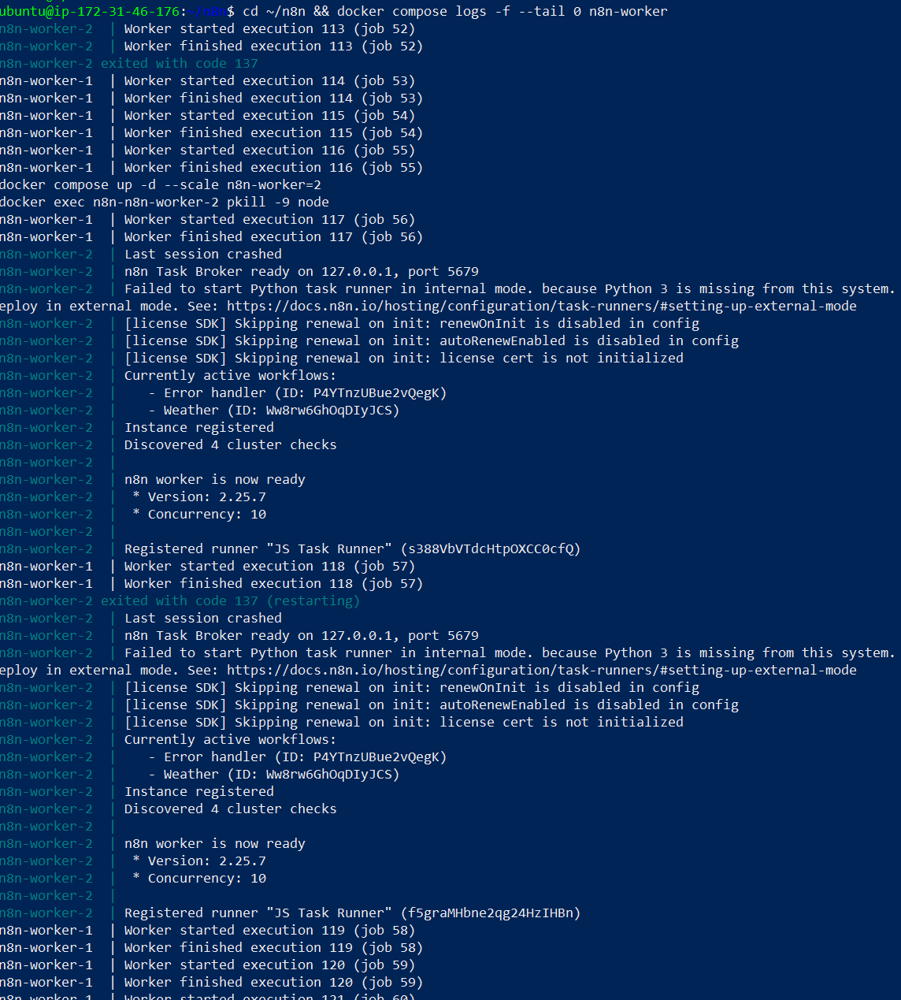
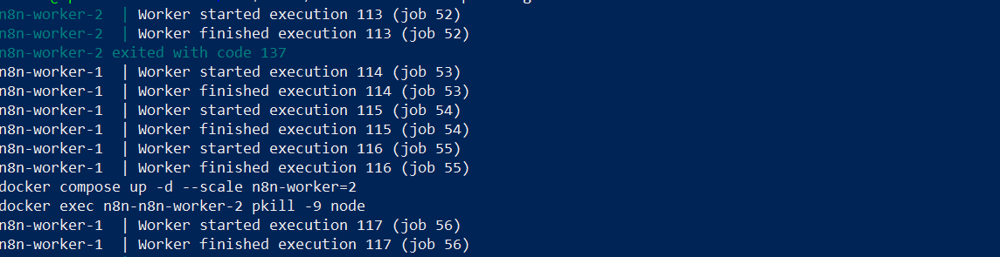
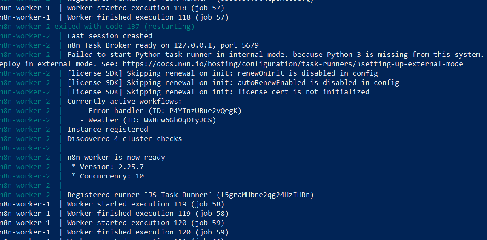

### Phase 4 — AI workflows
Built workflows on top of the stack, including an AI agent and an automated daily briefing, with the OpenAI key supplied at runtime (never stored in the repo).

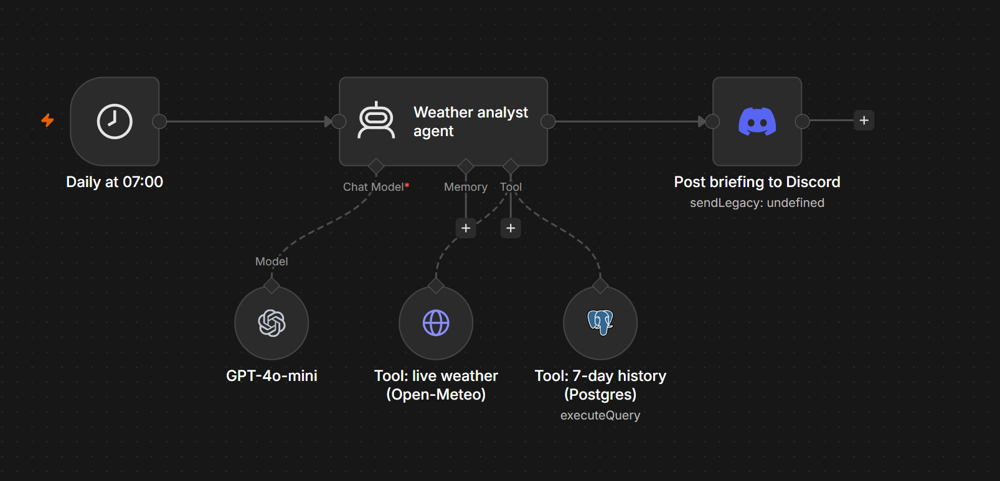
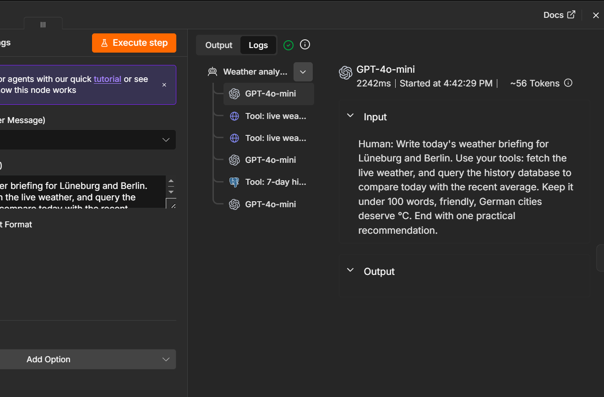
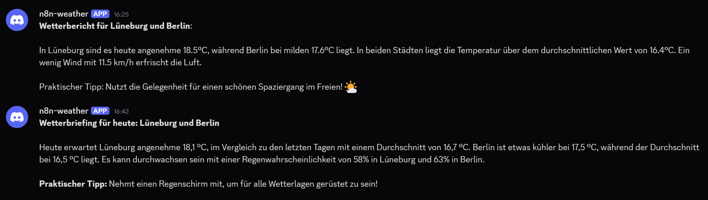

### Phase 5 — Migrate to Kubernetes (k3s)
Migrated the whole stack to **k3s** to run it the way larger deployments do. Demonstrated **rolling updates** (zero-downtime deploys), **horizontal scaling** of workers, **self-healing** pods, and a valid **TLS certificate** through ingress.

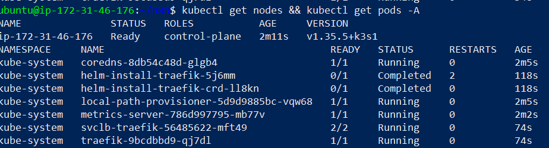
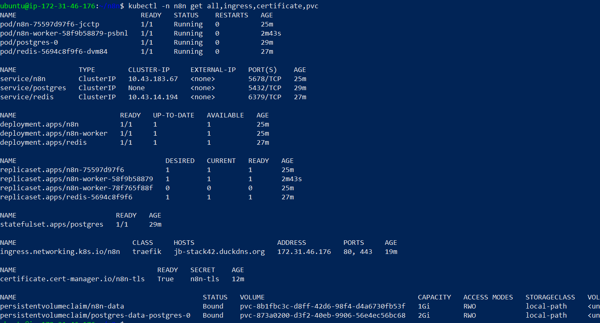
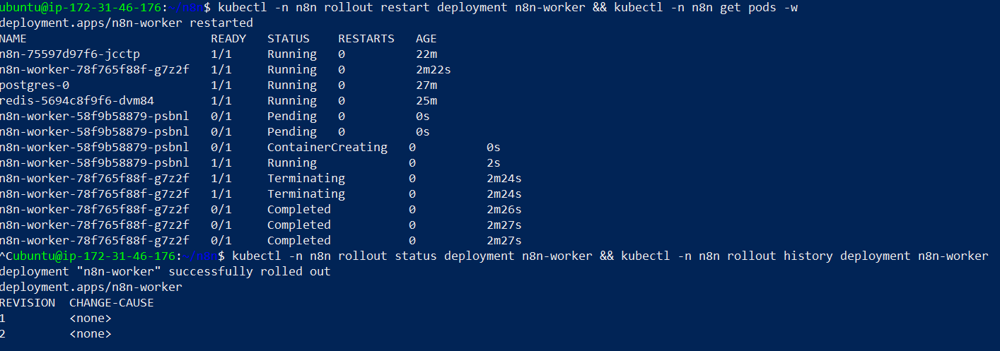
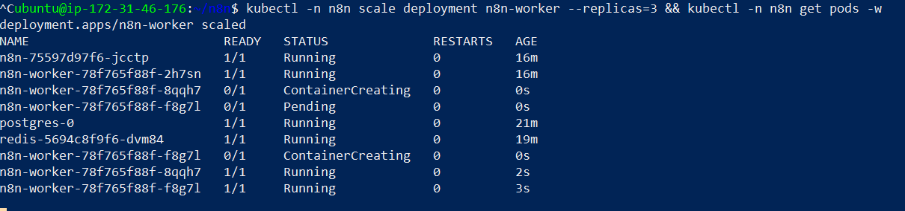
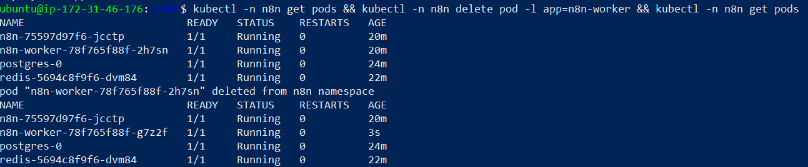
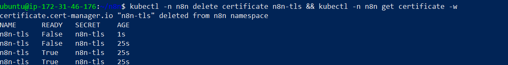

### Phase 6 — Document & teardown
This README, the architecture diagram, and a complete AWS teardown so the project leaves **zero billable resources** behind.

---

## Key decisions & trade-offs

**k3s instead of EKS.** EKS is the "default" managed Kubernetes on AWS, but it carries a control-plane fee and more moving parts than a single-node learning deployment needs. k3s gives a real, conformant Kubernetes experience (rolling updates, self-healing, scaling, ingress, TLS) on one `t3.medium` at no extra cost — the right fit for the goal here, with the EKS path well understood for when multi-node HA is actually required.

**Queue mode from the start.** Running n8n in queue mode (main + Redis + workers) rather than the single-process default is the configuration that matters for production: it's the difference between "the UI freezes while a big job runs" and "executions scale across workers independently of the editor."

**Caddy for TLS.** Caddy handles ACME certificate issuance and renewal automatically, which removes a common operational footgun (expired certs) with almost no configuration.

**Secrets discipline.** API keys live in n8n's Header-Auth credentials and are entered at runtime, never committed. Workflow JSON exports are scrubbed before they go in the repo.

**Cost guardrails first.** The billing alarm and dedicated, MFA-enabled IAM user were set up in Phase 0, before anything was provisioned — and the environment is torn down completely at the end.

---

## Repository contents

```
.
├── README.md              # this file
├── architecture.mmd       # editable Mermaid source for the diagram
├── architecture.svg       # rendered architecture diagram (vector)
├── architecture.png       # rendered architecture diagram (raster)
├── workflows/             # exported n8n workflows (secrets/IDs scrubbed → placeholders)
│   ├── ai-youtube-shorts.json
│   ├── weather-monitor.json
│   ├── weather-analyst-agent.json
│   └── error-handler.json
└── phase*.png             # screenshots for each build phase
```

> **Note on the workflows:** these are real exports with all credentials, personal IDs, and emails replaced by `YOUR_*` placeholders. Add your own n8n credentials and IDs to run them.

---

## Teardown

Because this is a learning/portfolio environment, every AWS resource is deleted at the end so ongoing cost is **$0**: terminate the EC2 instance, delete its EBS volume(s), release any Elastic IP, remove the security group and key pair, and deactivate the IAM user. A final check of the EC2 and Budgets consoles confirms nothing billable remains.

---

## What this demonstrates

- Running n8n the production way: managed DB, queue mode, workers, automatic HTTPS.
- Comfort across the stack — Linux host hardening, Docker Compose, Kubernetes (k3s), reverse proxies, dynamic DNS, TLS.
- Operational maturity: failover, self-healing, zero-downtime rolling updates, horizontal scaling.
- Cost and security hygiene: billing alarms, a dedicated MFA-enabled IAM user, secret management, clean teardown.

---
